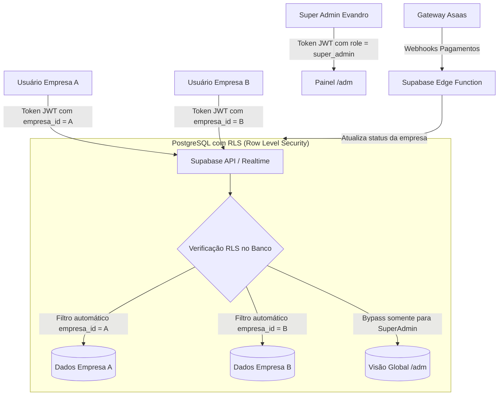
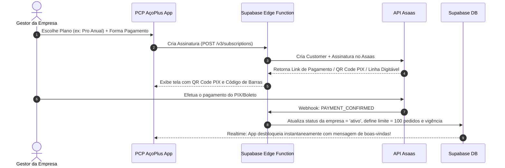

# Estudo de Viabilidade e Arquitetura: Transformação em SaaS Multi-Tenant (AçoPlus B2B)

## 1. Visão Geral e Objetivos

O objetivo deste estudo é estabelecer o plano arquitetural, de segurança, de negócio e financeiro para transformar o sistema **PCP AçoPlus** em uma plataforma **SaaS (Software as a Service) Multi-Tenant** comercializável para outras empresas do setor de corte, dobra e armação de aço.

### Requisitos Chave:
1. **Isolamento Absoluto e Seguro de Dados**: Garantir que uma empresa cliente **jamais** tenha acesso ou visualize dados de outra (pedidos, clientes, estoque, ordens, preços, arquivos).
2. **Painel Master do Administrador (`/adm`)**: Painel exclusivo para os donos da plataforma gerenciarem empresas contratantes, ativarem prospects, acompanharem métricas de uso e controlarem acessos.
3. **Gestão Descentralizada (Papel do Gestor)**: A plataforma cadastra o **Gestor** da empresa cliente com validação por e-mail; o próprio gestor cadastra e administra sua equipe (operadores, armadores, PCP, vendedores).
4. **Modo Degustação / Versão de Teste (Trial)**: Capacidade de liberar acessos de demonstração limitados por **tempo** (ex: 15 dias) e/ou por **volume** (ex: até 30 pedidos), com bloqueio e redirecionamento para contato comercial ao expirar.
5. **Cobrança Recorrente Automatizada via Asaas**: Assinaturas automáticas (Mensal, Trimestral e Anual), planos escalonados por **volume de pedidos**, sincronização em tempo real via Webhooks e régua de cobrança inteligente.

---

## 2. Arquitetura de Isolamento de Dados: Como Garantir Segurança Total

No modelo SaaS B2B, a segurança dos dados é o ativo mais valioso. Existem três arquiteturas possíveis:

| Modelo | Descrição | Segurança | Custo Infra | Manutenção | Recomendado? |
| :--- | :--- | :--- | :--- | :--- | :--- |
| **A. Banco Compartilhado com RLS** *(Supabase nativo)* | Um único PostgreSQL onde **todas** as tabelas possuem a coluna `empresa_id`, protegidas por **Row Level Security (RLS)** nativo do banco. | ⭐️⭐️⭐️⭐️⭐️ (Máxima) | 🟢 Baixo | 🟢 Simples (1 banco) | **SIM (Padrão de Mercado)** |
| **B. Schemas Separados** *(Schema-per-tenant)* | Um banco com schemas separados (`empresa_a.pedidos`, `empresa_b.pedidos`). | ⭐️⭐️⭐️⭐️ | 🟡 Médio | 🔴 Complexa (migrações em múltiplos schemas) | Não para a fase atual |
| **C. Banco Separado** *(Database-per-tenant)* | Uma instância de banco/Supabase para cada empresa. | ⭐️⭐️⭐️⭐️⭐️ | 🔴 Muito Alto | 🔴 Inviável comercialmente no início | Não |

### Por que o Modelo A (Supabase RLS) é a escolha ideal?
- **Impenetrável a nível de Banco de Dados**: O RLS (Row Level Security) é executado **dentro do motor do PostgreSQL**, não no código Flutter. Mesmo que um usuário mal-intencionado tente alterar requisições no navegador ou inspecionar a rede, o PostgreSQL rejeita qualquer leitura ou gravação fora do `empresa_id` registrado no token JWT criptografado dele.
- **Armazenamento de Arquivos Isolado (Supabase Storage)**: O armazenamento de arquivos (PDFs, DXFs, etiquetas) passa a ter pastas isoladas no bucket:
  `bucket/pedidos/{empresa_id}/{pedido_id}/...` com política de segurança onde o usuário só lê a pasta do seu próprio `empresa_id`.



---

## 3. Modelo Comercial: Planos por Volume de Pedidos & Cobrança Recorrente

No setor de corte e dobra de aço, o valor percebido do software está diretamente ligado à **escala operacional** da fábrica. Cobrar por **volume mensal de pedidos** é o modelo mais justo, transparente e com maior aceitação pelo mercado: pequenas empresas pagam pouco para começar, e médias/grandes pagam de acordo com o alto valor que extraem.

### 3.1. Estrutura Sugerida de Planos (Tiered Pricing)

| Nível do Plano | Perfil de Empresa | Volume de Pedidos/Mês | Usuários Inclusos | Mensal | Trimestral (-10%) | Anual (-20%) |
| :--- | :--- | :---: | :---: | :---: | :---: | :---: |
| **Start** | Serralherias / Armação Leve | **Até 30 pedidos** | Até 3 usuários | R$ 490 /mês | R$ 440 /mês *(R$ 1.320/tri)* | **R$ 390 /mês** *(R$ 4.680/ano)* |
| **Pro** *(Mais vendido)* | Fábricas em Expansão / Médias | **Até 100 pedidos** | Até 8 usuários | R$ 890 /mês | R$ 790 /mês *(R$ 2.370/tri)* | **R$ 690 /mês** *(R$ 8.280/ano)* |
| **Enterprise** | Grandes Indústrias / Alto Volume | **Até 300 pedidos** | Ilimitados | R$ 1.590 /mês | R$ 1.390 /mês *(R$ 4.170/tri)* | **R$ 1.190 /mês** *(R$ 14.280/ano)* |
| **Sob Medida** | Usinas / Mega Distribuidores | **Acima de 300 pedidos** | Customizado | Sob Consulta | Sob Consulta | Sob Consulta |

> [!TIP]
> **Estímulo ao Plano Anual**: No B2B industrial, as empresas preferem previsibilidade orçamentária e emissão de notas fiscais anuais. O desconto anual antecipa um caixa substancial para o seu negócio (ex: R$ 8.280 à vista no Pro).

---

## 4. Integração com Asaas: Automação Financeira de Ponta a Ponta

Como você já opera o Asaas em outra plataforma, reaproveitamos toda a robustez de emissão de PIX, Boletos com registro e Cartão de Crédito recorrente.

### 4.1. Fluxo de Contratação e Ativação


### 4.2. Eventos de Webhook do Asaas Gerenciados
A integração escuta os webhooks do Asaas de forma 100% automatizada:
1. `PAYMENT_CONFIRMED` / `PAYMENT_RECEIVED`:
   - Pagamento identificado com sucesso.
   - Seta `empresa.status = 'ativo'`, renova o ciclo de pedidos e atualiza a data de vencimento.
2. `PAYMENT_OVERDUE`:
   - Boleto ou PIX venceu e não foi pago.
   - Seta `empresa.status = 'inadimplente'`. Inicia a **Régua de Carência** (3 a 5 dias úteis) antes de qualquer bloqueio.
3. `PAYMENT_DELETED` / `SUBSCRIPTION_CANCELLED`:
   - Assinatura cancelada no Asaas.
   - Programa a suspensão do acesso para o término do período já pago.

### 4.3. Régua de Cobrança e Política de Estouro de Pedidos (B2B Friendly)
Em indústria de aço, travar o sistema abruptamente pode parar um caminhão carregado na expedição e gerar atrito grave com o cliente. Por isso, a política deve ser inteligente:

- **Se o cliente estourar a cota de pedidos do mês (ex: bateu 100 pedidos no plano Pro)**:
  - **Margem de Tolerância (Soft Cap)**: O sistema permite cadastrar até +10% de pedidos (ex: até 110), mas exibe um banner amigável para o Gestor:
    > *"Você atingiu 100% do limite de pedidos do seu Plano Pro neste mês! Sua produção continua liberada com margem de segurança. Faça o upgrade para o Plano Enterprise com 1 clique para manter sua equipe sem limites."*
- **Se a fatura vencer (Inadimplência)**:
  - **Dias 1 a 5 após vencimento**: Acesso liberado normalmente, com aviso discreto no topo apenas para o Gestor com botão *"Copiar chave PIX para pagamento"*.
  - **Após o 5º dia de carência**: Bloqueio das telas de criação e apontamento, mantendo apenas consulta e a tela de regularização financeira.

---

## 5. Estrutura de Contas e Hierarquia de Acesso

Para que a venda escale sem sobrecarregar a sua equipe de suporte, a governança deve ser descentralizada em 3 níveis:

### Nível 1: Super Administrador (Você / Donos da Plataforma)
- Acesso à rota restrita `/adm`.
- Cria novas empresas (Tenants), define planos, prazos de teste, limites de pedidos e bloqueia/ativa empresas.
- Possui ferramenta de **"Entrar como Empresa" (Impersonation / Modo Suporte)** para auxiliar clientes ou prospects caso relatem dúvidas.

### Nível 2: Gestor da Empresa Cliente (Tenant Admin)
- Primeiro usuário criado na empresa cliente quando um contrato ou teste é fechado.
- Recebe um **e-mail de ativação** oficial do sistema com link de convite (`supabase.auth.admin.inviteUserByEmail`).
- Ao clicar, confirma o e-mail, cadastra sua senha e acessa o sistema da sua empresa.
- **Poderes do Gestor**:
  - Cadastrar, ativar e inativar seus próprios colaboradores (operadores, armadores, vendedores, estoquistas).
  - Acessar a aba **Minha Assinatura / Financeiro** para visualizar faturas, mudar de plano ou emitir segunda via via Asaas.
  - O Gestor **não vê nem mexe** em nada de outras empresas nem na rota `/adm`.

### Nível 3: Usuários Operacionais da Empresa
- Operadores de corte/dobra, armadores, equipe de vendas e expedição cadastrados pelo Gestor.
- Não têm acesso à gestão de usuários nem a configurações gerais ou financeiras da empresa.

---

## 6. O Painel Administrativo Master: Rota `/adm`

O painel `/adm` será uma interface executiva com identidade premium, separada do fluxo operacional diário.

### 6.1. Dashboard Executivo do SaaS
- **Métricas Operacionais**:
  - Total de Empresas Ativas (Assinantes pagantes).
  - Empresas em Período de Teste (Prospects quentes).
  - Empresas Inadimplentes / Bloqueadas.
  - Volume total de pedidos processados no mês em toda a plataforma.
- **Métricas Financeiras (Integração Asaas)**:
  - **MRR (Monthly Recurring Revenue)**: Receita mensal recorrente gerada pelas assinaturas.
  - **Faturamento Previsto**: Valores a receber no mês em aberto.
  - **Taxa de Inadimplência**: Contratos com pagamento pendente.

### 6.2. Gestão de Empresas (Tenants)
Para cada empresa contratante ou prospect, o painel permitirá:
- **Dados Cadastrais**: Razão Social, Nome Fantasia, CNPJ, Cidade/UF, Nome do Contato, Telefone/WhatsApp e E-mail do Gestor.
- **Assinatura & Plano**:
  - Seleção do Plano: `Start (30)`, `Pro (100)`, `Enterprise (300)` ou `Custom`.
  - Ciclo: `Mensal`, `Trimestral` ou `Anual`.
  - ID da Assinatura no Asaas (`sub_xxxxxx`).
- **Status do Tenant**:
  - `degustacao` (Em teste gratuito)
  - `ativo` (Assinatura em dia)
  - `inadimplente` (Boleto/PIX vencido em período de carência)
  - `bloqueado` (Acesso suspenso por falta de pagamento ou fim do teste)
- **Ações Rápidas do Administrador**:
  - Botão "Gerar Link de Cobrança / 2ª Via Asaas".
  - Botão "Reenviar e-mail de ativação ao Gestor".
  - Botão "Prorrogar Teste (+7 dias / +10 pedidos)".
  - Botão "Acessar Ambiente como Suporte".

---

## 7. Mecanismo de Degustação / Versão de Teste (Trial)

Para enviar o sistema a um prospect com total segurança e sem risco de uso indevido continuado, aplicamos a estratégia de **Bloqueio em Duas Camadas**:

### Camada 1: Proteção Visual e Experiência do Prospect (Frontend)
- Enquanto o teste estiver válido:
  - Uma barra superior sutil exibe: *"Versão de Degustação: Restam 11 dias ou 14 pedidos de teste"*.
- Quando o teste expirar (por data ou limite de pedidos):
  - O sistema fecha as operações e apresenta uma tela profissional de encerramento com botão para falar com você no WhatsApp ou contratar um dos planos com desconto.

### Camada 2: Proteção Inviolável no Banco (Backend / Trigger PostgreSQL)
- Uma Trigger no banco rejeita a criação de novos pedidos ou ordens caso a empresa tenha ultrapassado a data limite ou o teto de pedidos do plano:
```sql
CREATE OR REPLACE FUNCTION validar_limite_empresa()
RETURNS TRIGGER AS $$
DECLARE
    v_empresa RECORD;
    v_qtd_pedidos INT;
BEGIN
    SELECT * INTO v_empresa FROM empresas WHERE id = NEW.empresa_id;
    
    IF v_empresa.status = 'bloqueado' THEN
        RAISE EXCEPTION 'Acesso da empresa suspenso. Contate o suporte comercial.';
    END IF;
    
    IF v_empresa.status = 'degustacao' THEN
        -- Verifica data de expiração
        IF v_empresa.expira_em IS NOT NULL AND NOW() > v_empresa.expira_em THEN
            RAISE EXCEPTION 'Período de teste expirado.';
        END IF;
        
        -- Verifica limite de pedidos do trial
        SELECT COUNT(*) INTO v_qtd_pedidos FROM pedidos WHERE empresa_id = NEW.empresa_id;
        IF v_empresa.limite_pedidos IS NOT NULL AND v_qtd_pedidos >= v_empresa.limite_pedidos THEN
            RAISE EXCEPTION 'Limite de pedidos do período de teste atingido (% pedidos).', v_empresa.limite_pedidos;
        END IF;
    END IF;
    
    RETURN NEW;
END;
$$ LANGUAGE plpgsql;
```

---

## 8. Roteiro Prático de Implementação (Roadmap)

Para implantar essa infraestrutura sem paralisar ou comprometer a operação atual da sua empresa, o trabalho deve ser dividido em 5 fases:

```
[Fase 1: Preparação do Banco & Isolamento RLS]
  ├── Criação da tabela 'empresas', 'planos' e 'saas_admins'
  ├── Registro da empresa atual como 'Empresa #1 (Matriz)'
  ├── Adição da coluna 'empresa_id' em todas as tabelas
  └── Ativação das políticas de RLS (Row Level Security)

[Fase 2: Autenticação Segura & Gestor]
  ├── Migração para Supabase Auth oficial
  ├── Fluxo de convite e confirmação de conta do Gestor por e-mail
  └── Hierarquia de permissões por empresa

[Fase 3: Painel Master /adm]
  ├── Rota /adm com layout executivo e dashboard de métricas
  ├── Gestão de empresas (cadastro, limites de teste, status)
  └── Ferramenta de "Entrar como Empresa" (modo suporte)

[Fase 4: Integração Financeira Asaas]
  ├── Supabase Edge Function para escuta de Webhooks do Asaas
  ├── Cadastro automático de clientes e assinaturas no Asaas
  ├── Tela "Minha Assinatura" para o Gestor no app
  └── Régua de cobrança automática (ativo, inadimplente, bloqueado)

[Fase 5: Modo Degustação & Onboarding de Vendas]
  ├── Barra de contagem regressiva de trial
  ├── Bloqueio amigável com CTA comercial para fechamento
  └── Testes de ponta a ponta com cliente simulado
```

---

## 9. Conclusão e Próximos Passos

Com a adição da camada de **cobrança recorrente via Asaas** e da **precificação baseada no volume de pedidos**, a plataforma deixa de ser apenas uma ferramenta interna de controle de fábrica e passa a ser uma **máquina de receita previsível (MRR)** com altíssimo valor agregado para o mercado de corte e dobra.
